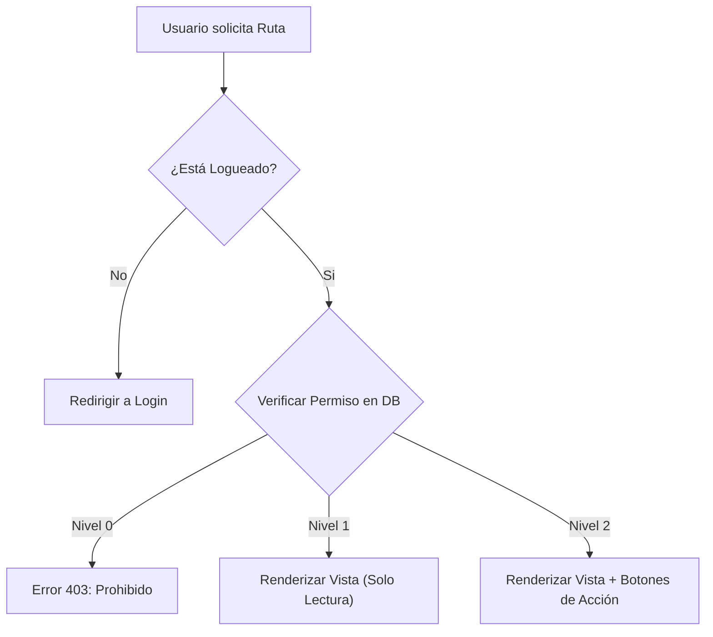
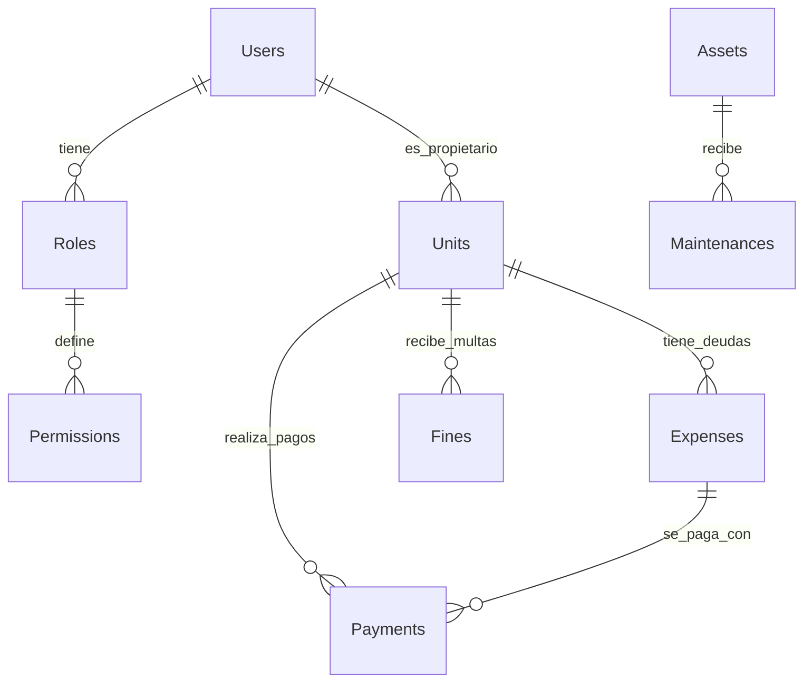

# 🏢 CondoManager ERP - InfiWebSpA

Sistema integral de gestión para comunidades y edificios (Clon de arquitectura Edifito), desarrollado en **Python Flask**. 
Este ERP se caracteriza por un sistema de seguridad granular basado en **Roles y Permisos (ACL)**, permitiendo configurar accesos de Lectura (1) y Escritura (2) para cada función específica.

---

## 🚀 Instalación y Puesta en Marcha

1. **Clonar el repositorio** y acceder a la carpeta.
2. **Crear entorno virtual**:
   ```bash
   python -m venv venv
   source venv/bin/activate  # En Windows: venv\Scripts\activate
   ```
3. **Instalar dependencias**:
   ```bash
   pip install flask flask-sqlalchemy flask-login
   ```
4. **Inicializar Base de Datos (Seed)**:
   Este script crea las tablas, los roles, el usuario Super Admin y la estructura de módulos.
   ```bash
   python seed.py
   ```
5. **Ejecutar el Sistema**:
   ```bash
   python run.py
   ```
   *Credenciales por defecto: `admin` / `admin123`*

---

## 🧠 Núcleo de Seguridad (ACL & Roles)

El sistema no utiliza roles estáticos en el código. Utiliza una **Matriz de Permisos en Base de Datos**.

### Niveles de Acceso
| Nivel | Descripción | Comportamiento |
| :---: | :--- | :--- |
| **0** | **Sin Acceso** | El módulo no aparece en el menú lateral. Ruta bloqueada (403). |
| **1** | **Lectura** | Puede ver listas y reportes. Botones de "Crear/Editar" ocultos. |
| **2** | **Escritura** | Acceso total. Puede crear, editar, eliminar y aprobar. |

### Diagrama de Flujo de Autorización




---

## 📦 Módulos y Funcionalidades

### 1. 👥 Módulo Comunidad
Enfocado en la comunicación entre la administración y los residentes.

*   **📰 Noticias:**
    *   **Admin:** Publica comunicados (pueden marcarse como Importantes).
    *   **Residente:** Visualiza el tablero.
*   **🎫 Incidencias (Ticketera):**
    *   **Lógica:** Los residentes solo ven sus propios tickets. El personal (Admin/Conserje) ve todos.
    *   **Flujo:** Residente crea ticket (Pendiente) -> Admin responde (En Revisión) -> Admin cierra (Resuelta).

### 2. 👮 Módulo Portería
Herramientas operativas para conserjería y seguridad.

*   **📦 Paquetería:**
    *   Registro de encomiendas entrantes.
    *   Control de estado: `En Conserjería` -> `Entregado` (registrando quién retiró).
*   **📖 Libro de Visitas:**
    *   Registro de entrada de visitas y proveedores.
    *   **Monitor en Tiempo Real:** Muestra en rojo quiénes están dentro del edificio actualmente.
    *   Registro de hora de salida.

### 3. 💰 Módulo Administración (Finanzas)
El corazón financiero del ERP. Incluye lógica contable avanzada.

*   **🏢 Registro Copropietarios:** CRUD de Unidades (Departamentos) y propietarios.
*   **💸 Gastos Comunes:**
    *   Generación de cobros masivos o individuales.
    *   **Lógica de Abonos Parciales:** Si una deuda es de $100.000 y pagan $40.000, el estado cambia a `Parcial` y muestra el saldo restante ($60.000).
*   **🧾 Informes de Pago:**
    *   **Residente:** Informa una transferencia (adjunta comprobante).
    *   **Admin:** Concilia (Aprueba/Rechaza). Al aprobar, la deuda se actualiza automáticamente.
*   **🚨 Multas:**
    *   **Automatización:** Al cursar una multa, el sistema **crea automáticamente** una deuda en Gastos Comunes asociada a esa unidad.
*   **📉 Informe de Morosos:**
    *   Reporte inteligente que agrupa todas las deudas impagas por unidad.
    *   Calcula antigüedad de la deuda y ordena por monto mayor.
    *   Botón para enviar notificación de cobranza.
*   **📊 Presupuesto:**
    *   Comparativa mensual: `Presupuesto Planificado` vs `Gasto Real`.
    *   Cálculo automático de desviación y barras de progreso visuales.
*   **👷 Remuneraciones:**
    *   Registro de liquidaciones de sueldo (Base + Bonos - Descuentos).
    *   **Integración Bancaria:** Botón directo para abrir portal bancario y pagar.
*   **🏦 Conciliación Bancaria:**
    *   **Izquierda:** Movimientos del Sistema (Ingresos por GC + Egresos por Sueldos + Ajustes de Caja).
    *   **Derecha:** Cartola Bancaria (Ingreso manual).
    *   **Objetivo:** Cruzar datos hasta que la diferencia sea $0.

### 4. 🛠️ Módulo Operaciones
Mantenimiento técnico del edificio.

*   **🏗️ Catastro:** Inventario de activos (Bombas, Ascensores, Calderas).
*   **📅 Mantenciones:** Calendario de tareas. Alertas visuales para tareas atrasadas.

---

## 📐 Estructura de Base de Datos (Simplificada)



---

## 📞 Soporte y Contacto

Desarrollado y mantenido por **InfiWebSpA**.

*   **📧 Correo:** iinfiwebspa.contactanos@gmail.com
*   **📱 Teléfonos:**
    *   +569 2036 8688
    *   +569 8909 6758

---
*Este proyecto es propiedad de InfiWebSpA. Prohibida su distribución no autorizada.*


